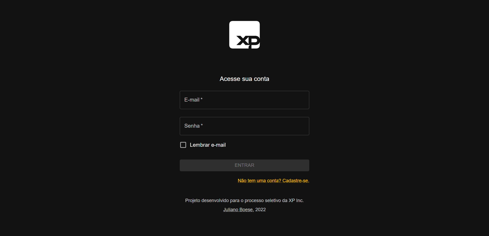
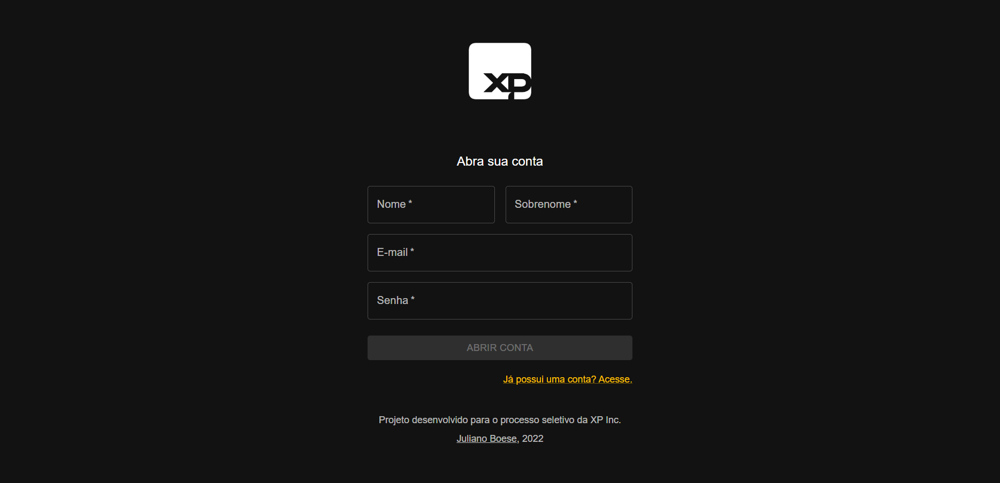
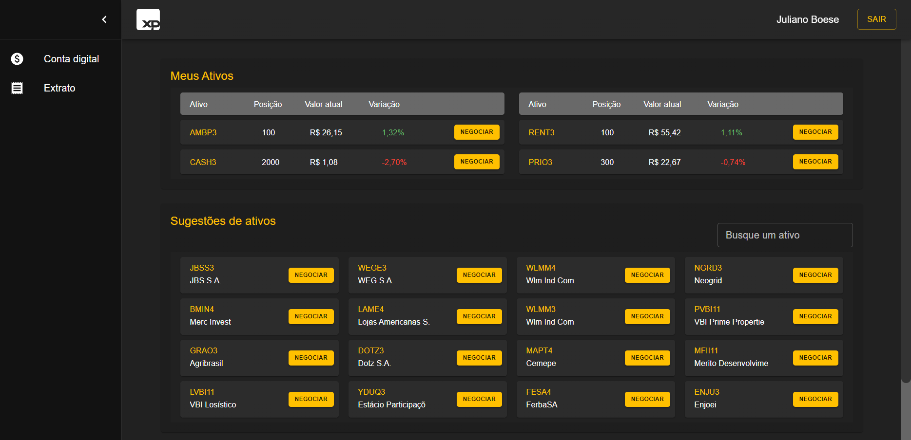

# Case XP - Front-End <!-- omit in toc -->

Projeto desenvolvido para o processo seletivo para Software Engineer I na XP Inc.

- Repo Back-End: https://github.com/julianoboese/case-xp-back-end
- Back-End em produção: https://case-xp-back-end.herokuapp.com/api
- Repo Front-End: https://github.com/julianoboese/case-xp-front-end
- Front-End em produção: https://case-xp-front-end.herokuapp.com

<hr />
<br />

- [💻 Projeto](#-projeto)
  - [Entregas](#entregas)
- [📈 Requisitos e Front-End](#-requisitos-e-front-end)
- [🚀 Tecnologias e Ferramentas](#-tecnologias-e-ferramentas)
- [⚡ Rodando o projeto localmente](#-rodando-o-projeto-localmente)
- [💬 Contatos](#-contatos)

<br />

## 💻 Projeto

### Entregas
1. **API RESTful** para uma aplicação de investimento em renda variável, com algumas funcionalidades de conta digital.
2. **MVP** com Front-End conectado à API 100% funcional.

<br />

## 📈 Requisitos e Front-End
Durante o desenvolvimento do projeto, **todos os requisitos** mínimos solicitados foram implementados, assim como **funcionalidades adicionais**.

### O Front-End foi dividido em 3 rotas: <!-- omit in toc -->

> Login (`/`)

Implementações:
- Validação dos campos (com o botão de "Entrar" ficando desabilitado até que os campos sejam válidos);
- Salvamento da última pessoa usuária logada (somente caso ela marque "Lembrar e-mail");
- Mensagens personalizadas de erro.



<br />

> Register (`/register`)

Implementações:
- Validação dos campos (com o botão de "Abrir conta" ficando desabilitado até que os campos sejam válidos);
- Mensagens personalizadas de erro.



<br />

> Dashboard (`/dashboard`)

Funcionalidades:
- Ativos que a pessoa usuária possui
  - Informações detalhadas, como a quantidade, o preço real e a variação no dia;
- Sugestões de ativos
  - Mais de 500 ativos disponíveis;
  - Campo para busca pelo nome ou ticker do ativo;
- Compra / Venda de ativos
  - Boleta com informações de poder de compra e venda;
  - Botões desabilitados caso não seja possível realizar a operação;
  - Campo de quantidade de ativos aceitando somente números inteiros;
- Conta digital
  - Exibição do saldo atual e campo para depósito ou retirada;
  - Botões desabilitados caso não seja possível realizar a operação;
- Extrato
  - Tabela com dados detalhados de todas as operações realizadas na conta.



<br />

## 🚀 Tecnologias e Ferramentas
O projeto foi desenvolvido com as seguintes tecnologias e ferramentas:

- Linguagem: **JavaScript**
- Framework: **React**
- Componentes: **Funcionais - Hooks**
- Gerenciamento de estado: **Context API**
- Estilização: **Material UI**

<br />

## ⚡ Rodando o projeto localmente

O projeto pode ser executando localmente em um contêiner Docker. Para isso, basta:
> Rodar o contêiner com
```bash
docker-compose up -d
``` 
> Acessar o terminal da aplicação com
```bash
docker exec -it case-xp bash
``` 
> Dentro da aplicação, instalar as dependências
```bash
npm install
``` 
> E iniciar a aplicação
```bash
npm start
``` 

<br />

<details>
  <summary><strong>Caso deseje executar o projeto direto em sua máquina</strong></summary><br />

Nesse caso:
- É necessário que sua máquina tenha o `node` instalado, preferencialmente na versão 16.
- Configure em um arquivo `.env` as variáveis de ambiente indicadas no arquivo de exemplo.

Após isso, basta
> Instalar as dependências
```bash
npm install
``` 
> E iniciar a aplicação
```bash
npm start
``` 

</details>


<br />

## 💬 Contatos

<div align="center" style="display: inline_block">
  <a href="https://julianoboese.github.io" target="_blank"></a> 
  <a href="https://www.linkedin.com/in/julianoboese" target="_blank"></a> 
  <a href = "mailto:juliano.boese@gmail.com"></a>
</div>
